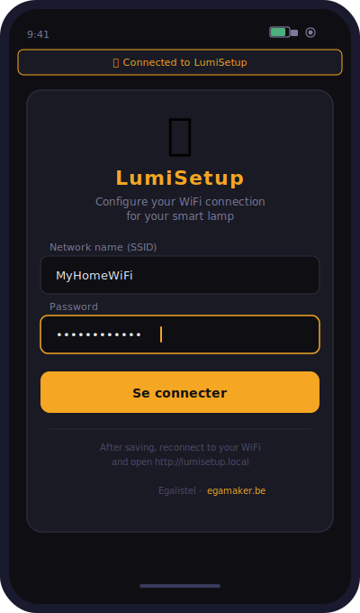
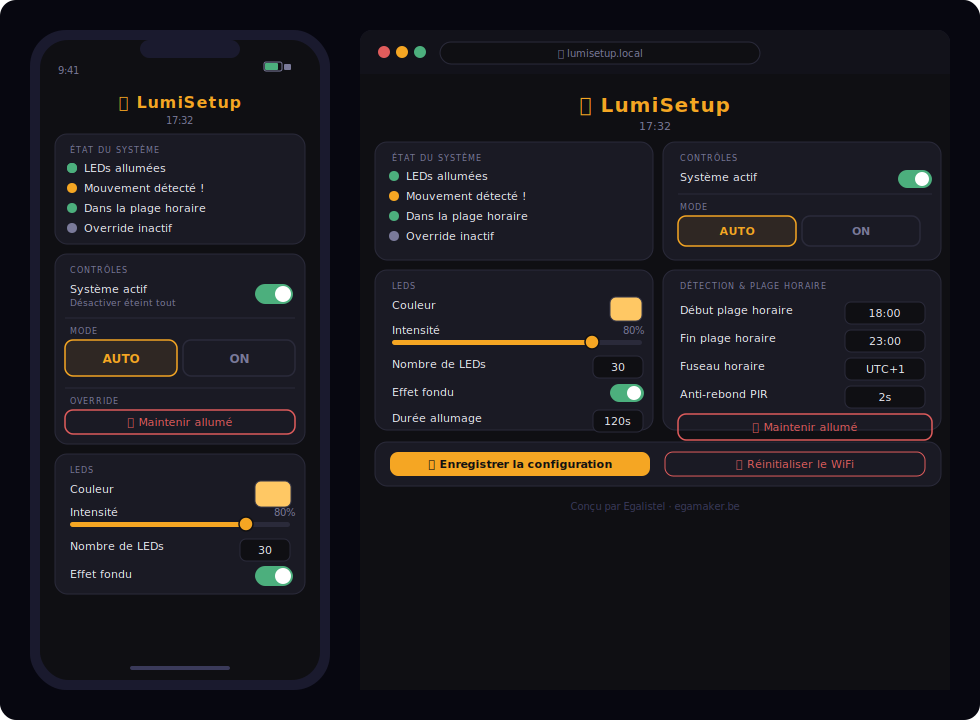
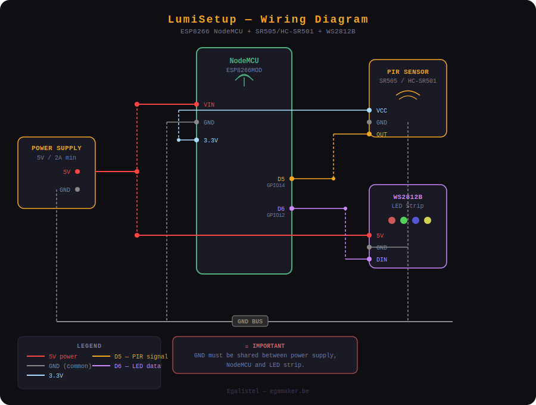

# 💡 LumiSetup — Smart PIR Lamp with ESP8266

A smart connected lamp based on an ESP8266 (NodeMCU), a PIR motion sensor, and WS2812B addressable LEDs. The lamp turns on automatically when motion is detected, within a configurable time range. Everything is managed through a built-in web interface, accessible from any device on your network.

Built by **Egalistel** — [egamaker.be](https://egamaker.be)

---

## 📸 Screenshots

| WiFi Setup Portal | Main Interface |
|:-----------------:|:--------------:|
|  |  |

---

## ✨ Features

- **AUTO mode** — PIR sensor triggers the LEDs within a defined time range
- **ON mode** — LEDs stay on permanently, regardless of the sensor or time
- **Override button** — Force the light on at any time, even outside the schedule. Press again to return to normal behavior
- **System toggle** — Enable or disable the entire system instantly
- **Captive portal** — On first boot, the ESP creates a WiFi access point (`LumiSetup`) for easy WiFi configuration
- **mDNS** — Access the interface at `http://lumisetup.local` without knowing the IP address
- **NTP time sync** — Accurate time from the internet, no RTC needed
- **Persistent config** — All settings saved to flash (LittleFS), survive reboots
- **Responsive web UI** — Works on mobile and desktop

---

## 🛒 Hardware

| Component | Details | Link |
|-----------|---------|------|
| ESP8266 NodeMCU | ESP-12E / ESP8266MOD | [AliExpress](https://s.click.aliexpress.com/e/_c3FoVFgx) |
| PIR Sensor | SR505 or HC-SR501 (recommended) | [AliExpress](https://s.click.aliexpress.com/e/_c4lxAc4J) |
| LEDs | WS2812B addressable strip | [AliExpress](https://s.click.aliexpress.com/e/_c4LMDEiT) |
| Power supply | 5V external (min. 2A for 30 LEDs) | [AliExpress](https://s.click.aliexpress.com/e/_c3k73Qgn) |
| DC Power connector | 5.5mm x 2.1mm female jack (for clean wiring) | [AliExpress](https://s.click.aliexpress.com/e/_c42pIl07) |

> ⚠️ The HC-SR501 is recommended over the SR505 — it has adjustable sensitivity and a much shorter retriggering time.

---

## 🔌 Wiring



```
PIR Sensor       NodeMCU
  VCC       →    3.3V
  GND       →    GND
  OUT       →    D5 (GPIO14)

WS2812B          NodeMCU + Power supply
  5V        →    External 5V
  GND       →    GND (shared with NodeMCU !)
  DIN       →    D6 (GPIO12)

Power supply
  5V        →    VIN (NodeMCU)  +  5V (LEDs)
  GND       →    GND (NodeMCU)  +  GND (LEDs)
```

> ⚠️ The GND must be common between the external power supply and the NodeMCU. Without this, the LEDs will not work correctly.

---

## 📦 Required Libraries

Install these from the Arduino Library Manager or GitHub:

| Library | Source |
|---------|--------|
| FastLED | Arduino Library Manager |
| ESPAsyncWebServer | [GitHub - me-no-dev](https://github.com/me-no-dev/ESPAsyncWebServer) |
| ESPAsyncTCP | [GitHub - me-no-dev](https://github.com/me-no-dev/ESPAsyncTCP) |
| ArduinoJson v6 | Arduino Library Manager |
| NTPClient | Arduino Library Manager |

> ⚠️ Do NOT install WiFiManager — it conflicts with ESPAsyncWebServer. The captive portal is handled directly in the code.

---

## 🚀 Installation

### 1. Board setup
- In Arduino IDE, add the ESP8266 board URL:
  ```
  https://arduino.esp8266.com/stable/package_esp8266com_index.json
  ```
- Select **NodeMCU 1.0 (ESP-12E Module)**
- Flash Size: **4MB (FS:2MB)**

### 2. Upload the sketch
- Open `lampe_esp8266.ino` in Arduino IDE
- Upload to your NodeMCU

### 3. First boot — WiFi setup
- The ESP creates a WiFi access point: **`LumiSetup`** (password: `lumi1234`)
- Connect to it from your phone or PC
- The configuration page opens automatically (or go to `http://192.168.4.1`)
- Enter your WiFi credentials and click **Se connecter**
- The ESP restarts and joins your network

### 4. Access the interface
- Open `http://lumisetup.local` in your browser
- Or use the IP address shown in the Serial Monitor

---

## 🖥️ Web Interface

### Main controls
| Element | Description |
|---------|-------------|
| System toggle | Enable / disable everything |
| AUTO mode | PIR active within the time range |
| ON mode | LEDs always on |
| Override button | Force light on regardless of schedule |

### Configuration
| Parameter | Description |
|-----------|-------------|
| Color | RGB color of the LEDs |
| Brightness | 0–100% |
| Number of LEDs | Strip length |
| On duration | Seconds the light stays on after detection |
| PIR debounce | Minimum delay between two triggers (seconds) |
| Fade effect | Smooth fade-in / fade-out |
| Time range | Active hours for AUTO mode (e.g. 18:00–23:00) |
| Timezone | UTC offset for NTP sync |

---

## 🔄 Reset WiFi

To change your WiFi credentials:
- Open the web interface → scroll down → click **📶 Réinitialiser la connexion WiFi**
- Confirm → the ESP restarts and opens the `LumiSetup` access point again

---

## 📁 Project Structure

```
lumisetup-esp8266/
└── lampe_esp8266.ino    ← Single file, all code + embedded HTML/CSS/JS
```

---

## 📄 License

MIT License — see [LICENSE](LICENSE) for details.

---

## 🙏 Credits

Made with ❤️ by **Egalistel** — [egamaker.be](https://egamaker.be)

If this project helped you, consider buying me a coffee ☕

[](https://buymeacoffee.com/egalistelw)
